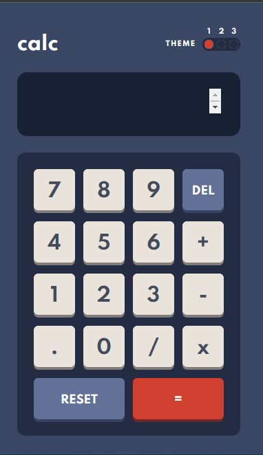

# Frontend Mentor - Calculator app solution

This is a solution to the [Calculator app challenge on Frontend Mentor](https://www.frontendmentor.io/challenges/calculator-app-9lteq5N29). Frontend Mentor challenges help you improve your coding skills by building realistic projects.

## Table of contents

- [Overview](#overview)
  - [The challenge](#the-challenge)
  - [Screenshot](#screenshot)
  - [Links](#links)
- [My process](#my-process)
  - [Built with](#built-with)
  - [What I learned](#what-i-learned)
  - [Continued development](#continued-development)
- [Author](#author)

## Overview

### The challenge

Users should be able to:

- See the size of the elements adjust based on their device's screen size
- Perform mathematical operations like addition, subtraction, multiplication, and division
- Adjust the color theme based on their preference

### Screenshot



### Links

- Solution URL: [Click Here](https://github.com/dulranga/Multi-Theme-Calculator)
- Live Site URL: [Click Here](http://multi-theme-calculator.vercel.app/)

## My Process

### Built with

- Flexbox
- CSS variables
- CSS Grid
- [React](https://reactjs.org/) - JS library
- [Next.js](https://nextjs.org/) - React framework

### What I learned

- Splitting number with comma `122,212,654`

```js
"124539493".replace(/\B(?=(\d{3})+(?!\d))/g, ",");
```

- Resize the display panel when expression get long

```js
useLayoutEffect(() => {
  displayRef.current.style.height = "auto";
  displayRef.current.style.height = displayRef.current.scrollHeight + "px";
}, [expression]);
```

### Continued development

1. Add keyboard listeners
2. Keyboard shortcuts to toggle theme
3. More Arithmetic Operations

## Author

- Website - [dulranga.ml](https://www.dulranga.ml)
- Frontend Mentor - [@dulranga](https://www.frontendmentor.io/profile/dulranga)
- Twitter - [@dulrangaD](https://www.twitter.com/dulrangaD)
